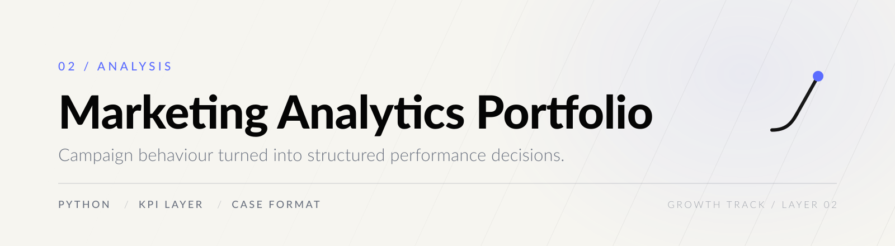
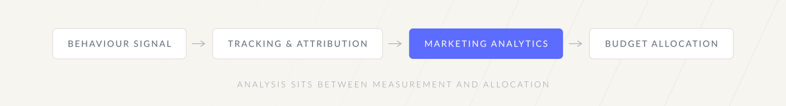

<p align="center">
  <picture>
    <source media="(prefers-color-scheme: dark)" srcset="assets/brand/header-dark.svg">
    
  </picture>
</p>

<p align="center">
  
  
  
  
</p>

**A campaign report is not a decision.** This layer sits between measured events and allocated
budget: it takes campaign behaviour and returns what changed, what matters, and what to do next.

---

## 01 — The decision this supports

Given campaign or funnel data, answer three questions in order:

| | Question | Output |
| --- | --- | --- |
| **01** | What changed? | Movement isolated from noise. |
| **02** | What matters? | The subset of movement with economic weight. |
| **03** | What decision follows? | A named next action, with its limitation attached. |

Analysis that stops at the first question is a dashboard, not a decision.

---

## 02 — The KPI layer

[`src/marketing_analytics/kpis.py`](src/marketing_analytics/kpis.py) keeps the definitions in one
place so that CPA and ROAS mean the same thing in every case study.

| Metric | Definition | Guard |
| --- | --- | --- |
| **CPA** | `spend / conversions` | Returns `None` at zero conversions rather than dividing by zero. |
| **ROAS** | `revenue / spend` | Returns `None` at zero spend. |
| **Conversion rate** | `conversions / clicks` | Returns `None` at zero clicks. |

Returning `None` is deliberate. A missing metric is information; a silent `0.0` or a crash is not.
`summarize_campaigns()` aggregates a list of campaigns and applies the same guards at portfolio level.

---

## 03 — The case format

Every case study in this repository follows one structure, so that findings stay auditable and
conclusions can be separated from the evidence that produced them.

```text
Context  ->  Question  ->  Data  ->  Method  ->  Finding  ->  Decision  ->  Limitation
```

The last field is not optional. Template: [`cases/campaign-diagnostics-template.md`](cases/campaign-diagnostics-template.md).

---

## 04 — Contents

| Path | Contents |
| --- | --- |
| [`src/marketing_analytics/kpis.py`](src/marketing_analytics/kpis.py) | Reusable KPI helpers for spend, conversions, CPA, ROAS and conversion rate. |
| [`data/sample_campaign_daily.csv`](data/sample_campaign_daily.csv) | Synthetic campaign data, used only to make the examples executable. |
| [`cases/campaign-diagnostics-template.md`](cases/campaign-diagnostics-template.md) | The case format above. |
| [`docs/source-review.md`](docs/source-review.md) | What was found in the previous repositories and why only curated content was migrated. |

---

## 05 — Run

```bash
python -m pytest
```

---

## 06 — Limitations

- The audited repositories contained **no clean publishable campaign dataset**. The included data is
  synthetic and exists only to validate the KPI code and the documentation structure.
- The KPI layer is **definitional**, not inferential: it computes agreed metrics. It does not model
  attribution, incrementality or media mix.
- Synthetic data can validate code. It cannot validate a marketing conclusion.

---

## Growth track

<p align="center">
  <picture>
    <source media="(prefers-color-scheme: dark)" srcset="assets/brand/chain-dark.svg">
    
  </picture>
</p>

<p align="center">
  <a href="https://github.com/arielabade/tracking-attribution-lab">Previous layer: Tracking &amp; Attribution Lab</a>
  &nbsp;·&nbsp;
  <a href="https://github.com/arielabade/paid-media-budget-optimizer">Next layer: Paid Media Budget Optimizer</a>
  &nbsp;·&nbsp;
  <a href="https://github.com/arielabade">Portfolio overview</a>
</p>
